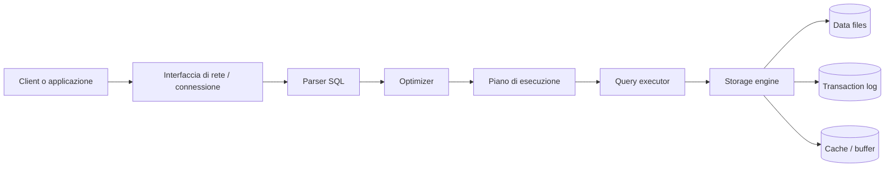
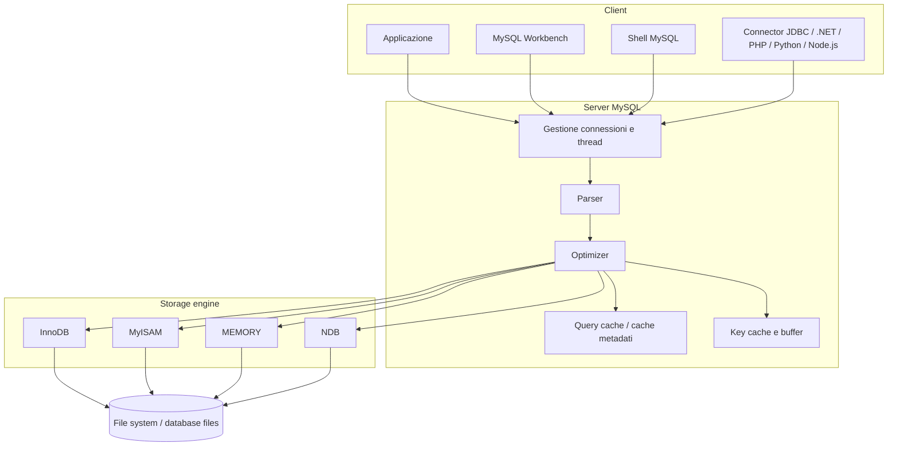
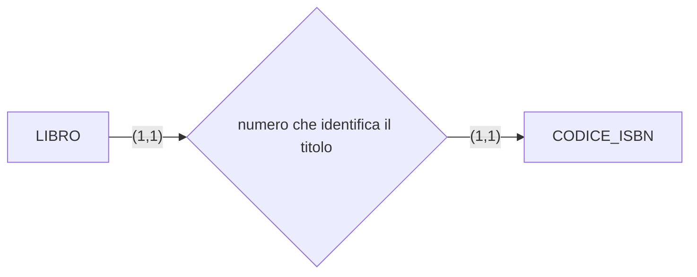
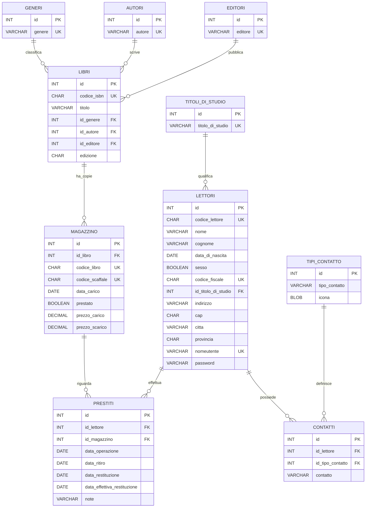

# Note della lezione

## Database e DBMS

- Un **DB** (*Database*) è un archivio organizzato di dati.
- Un **DBMS** (*Database Management System*) è il software che permette di creare, gestire, proteggere e interrogare un database.
- Il **DBA** (*Database Administrator*) è la figura che crea, amministra e mantiene i database: gestisce accessi, sicurezza, backup, manutenzione, prestazioni e organizzazione generale dei dati.

Il ruolo del **DBA** è importante perché:

- crea i database con tutti gli oggetti e i vincoli previsti dallo **schema fisico**;
- imposta permessi e autorizzazioni degli utenti;
- pianifica e gestisce backup, restore e operazioni di manutenzione;
- usa sia gli strumenti grafici o i pannelli di controllo del client sia il linguaggio SQL.

## Database nel web development

Nel web development, collegare una pagina web a un database rappresenta il passaggio da un sito **statico** a un'applicazione **dinamica**.

- Un sito statico mostra contenuti già scritti nei file HTML, CSS e JavaScript.
- Un'applicazione dinamica può leggere, salvare, modificare e cancellare dati in base alle richieste degli utenti.

Per motivi di sicurezza, il browser non dovrebbe mai accedere direttamente al database.

Tra **frontend** e **database** si inserisce un **backend**, sviluppato ad esempio con:

- Node.js;
- PHP;
- Python;
- Java.

Il backend ha il compito di:

- ricevere le richieste dal frontend;
- validare i dati ricevuti;
- applicare le regole dell'applicazione;
- comunicare con il database;
- restituire una risposta al frontend.

Schema generale:

```text
Frontend HTML/CSS/JS
        |
        | richiesta HTTP
        v
Backend Node.js / PHP / Python / Java
        |
        | query SQL
        v
Database
```

Questo modello separa correttamente:

- **presentazione**, cioè l'interfaccia vista dall'utente;
- **logica applicativa**, cioè le regole e i controlli gestiti dal backend;
- **persistenza dei dati**, cioè il salvataggio stabile delle informazioni nel database.

Questa separazione rende il sistema più sicuro, ordinato e scalabile.

## SQL

**SQL** significa **Structured Query Language**.

È un linguaggio standard per l'archiviazione, la manipolazione e il recupero dei dati nei database.

È stato creato da **IBM** nel **1974** come strumento per gestire database relazionali. Inizialmente era chiamato **SEQUEL**, poi il nome è diventato **SQL**.

Nel **1983** IBM crea **DB2**, uno dei DBMS relazionali più importanti, ancora oggi usato soprattutto in contesti aziendali.

Nel **1986** SQL viene riconosciuto dall'**ANSI** (*American National Standards Institute*) e nasce lo standard **SQL/86**. Da quel momento gli standard SQL si sono evoluti con l'obiettivo di rendere il linguaggio il più possibile comune tra i diversi DBMS relazionali.

SQL è un linguaggio specifico di dominio, cioè un **DSL** (*Domain Specific Language*): non serve per costruire programmi completi come JavaScript o Python, ma per comunicare con un **RDBMS** (*Relational Database Management System*).

Anche se SQL è uno standard **ANSI/ISO**, i vari DBMS possono avere versioni, funzioni ed estensioni proprietarie diverse. Per questo motivo una query valida in MySQL potrebbe richiedere piccole modifiche in PostgreSQL, SQLite, SQL Server o Oracle.

Con il tempo SQL è stato esteso anche con funzionalità più vicine alla programmazione server-side. Alcuni linguaggi procedurali collegati a SQL sono:

- **PL/SQL**, usato da Oracle;
- **T-SQL**, usato da Microsoft SQL Server.

Con SQL si possono fare operazioni come:

- creare database e tabelle;
- inserire nuovi record;
- leggere e filtrare dati;
- aggiornare informazioni già presenti;
- eliminare record;
- definire vincoli, indici e relazioni;
- gestire utenti, permessi e transazioni.

Un database relazionale può essere riassunto come una serie di **tabelle** identificate da un nome. Le tabelle possono essere collegate tra loro, sono divise in **colonne** per gli attributi e in **righe** o **record** per le informazioni salvate.

### Query

L'interrogazione di un database avviene tramite una **query**.

Una query è un'espressione, o una serie di espressioni, con cui si fa una richiesta al database per ottenere una risposta, di solito sotto forma di tabella.

Esempio:

```sql
SELECT *
FROM world.country;
```

Questa query interroga il database `world` e seleziona tutti i campi della tabella `country`. L'asterisco `*` significa "tutte le colonne".

Esempio con una sola colonna:

```sql
SELECT Continent
FROM world.country;
```

In questo caso il risultato contiene solo la colonna `Continent` della tabella `country`, con i valori presenti in tutte le righe.

### Sintassi SQL

SQL non è sensibile alle maiuscole e minuscole per le parole chiave: `select` e `SELECT` sono equivalenti.

Attenzione: questo non vale sempre per i nomi di database, tabelle e colonne, perché il comportamento può dipendere dal DBMS e dal sistema operativo.

Alcuni sistemi richiedono il punto e virgola `;` alla fine di ogni istruzione SQL. In generale, il punto e virgola è il modo standard per separare più istruzioni inviate nella stessa chiamata al server.

Esempio:

```sql
SELECT *
FROM Prodotti;
```

Le istruzioni SQL si possono raggruppare in alcune famiglie principali. Nelle classificazioni introduttive si usano spesso quattro macro-gruppi (`DDL`, `DML`, `DQL`, `DCL`); in molte spiegazioni si aggiunge anche `TCL`, dedicato alle transazioni.

| Famiglia | Significato | Esempi di comandi |
| --- | --- | --- |
| DDL | *Data Definition Language*, crea, modifica o elimina database e oggetti della struttura | `CREATE`, `ALTER`, `DROP` |
| DML | *Data Manipulation Language*, inserisce, modifica o cancella record nelle tabelle | `INSERT`, `UPDATE`, `DELETE` |
| DQL | *Data Query Language*, interroga il database e produce risultati | `SELECT` |
| DCL | *Data Control Language*, gestisce permessi e autorizzazioni degli utenti | `GRANT`, `REVOKE` |
| TCL | *Transaction Control Language*, gestisce le transazioni | `COMMIT`, `ROLLBACK` |

Alcuni comandi SQL importanti:

| Comando | Funzione |
| --- | --- |
| `SELECT` | Estrae dati da un database. |
| `INSERT INTO` | Inserisce nuovi dati in una tabella. |
| `UPDATE` | Aggiorna dati già presenti. |
| `DELETE` | Elimina dati da una tabella. |
| `CREATE DATABASE` | Crea un nuovo database. |
| `ALTER DATABASE` | Modifica un database. |
| `CREATE TABLE` | Crea una nuova tabella. |
| `ALTER TABLE` | Modifica la struttura di una tabella. |
| `DROP TABLE` | Elimina una tabella. |
| `CREATE INDEX` | Crea un indice, cioè una chiave di ricerca. |
| `DROP INDEX` | Elimina un indice. |

### Comandi DDL

I comandi **DDL** (*Data Definition Language*) permettono di creare, modificare o eliminare un database e gli oggetti che ne caratterizzano la struttura.

Gli oggetti principali sono:

- database;
- tabelle;
- viste;
- indici;
- vincoli;
- utenti.

I tre comandi DDL più importanti sono:

| Comando | Uso |
| --- | --- |
| `CREATE` | Crea database, tabelle, viste, indici, vincoli e utenti. |
| `ALTER` | Modifica oggetti già creati. |
| `DROP` | Elimina oggetti già creati. |

Dopo `CREATE`, `ALTER` o `DROP` bisogna indicare il tipo di oggetto e il nome dell'oggetto, ad esempio:

- `CREATE DATABASE NomeDatabase;`
- `CREATE TABLE NomeTabella (...);`
- `ALTER TABLE NomeTabella ...;`
- `DROP TABLE NomeTabella;`

### Creare un database

Per creare un database si usa il comando `CREATE DATABASE`.

Esempio:

```sql
CREATE DATABASE DBESERCIZISQL;
```

Si possono anche specificare set di caratteri e regole di confronto:

```sql
CREATE DATABASE DBESERCIZISQL
CHARACTER SET LATIN1
COLLATE LATIN1_SWEDISH_CI;
```

La clausola `COLLATE`, usata con `CREATE DATABASE` o `ALTER DATABASE`, permette di indicare le regole di confronto predefinite del database, ad esempio come vengono confrontate e ordinate le stringhe.

Nota: `LATIN1` è l'esempio della slide. In progetti moderni spesso si preferisce usare `utf8mb4`, perché gestisce meglio caratteri accentati, simboli e testi internazionali.

Comandi utili:

```sql
SHOW DATABASES;
```

Mostra i database disponibili.

```sql
USE DBESERCIZISQL;
```

Attiva la connessione con il database indicato. Da quel momento i comandi successivi si riferiscono a quel database, salvo indicazione diversa.

```sql
SHOW TABLES;
```

Mostra le tabelle presenti nel database attualmente selezionato.

### Creare una tabella

Per creare una tabella si usa il comando `CREATE TABLE`.

Esempio: creazione della tabella `LIBRI` a partire dallo schema fisico.

```sql
CREATE TABLE LIBRI (
    ID INT AUTO_INCREMENT PRIMARY KEY,
    CODICE_LIBRO CHAR(10) UNIQUE NOT NULL,
    CODICE_ISBN CHAR(10) NOT NULL,
    TITOLO VARCHAR(50) NOT NULL,
    ID_GENERE INT,
    ID_EDITORE INT,
    ID_AUTORE INT,
    EDIZIONE CHAR(4)
);
```

In questo esempio:

- `AUTO_INCREMENT` imposta la colonna come contatore automatico;
- `PRIMARY KEY` imposta la colonna come chiave primaria;
- `UNIQUE` imposta un vincolo di unicità;
- `NOT NULL` rende obbligatorio il contenuto della colonna.

La colonna `TITOLO` può essere indicizzata successivamente con `CREATE INDEX`:

```sql
CREATE INDEX IDX_LIBRI_TITOLO
ON LIBRI (TITOLO);
```

Le chiavi esterne possono essere aggiunte dopo aver creato le tabelle tipizzate, ad esempio `GENERI`, `EDITORI` e `AUTORI`.

### Modificare una tabella

Per modificare la struttura di una tabella esistente si usa `ALTER TABLE`.

Permette di:

- aggiungere, rimuovere o modificare colonne;
- aggiungere o rimuovere vincoli;
- attivare o disattivare vincoli, quando il DBMS lo consente.

Sintassi generale:

```sql
ALTER TABLE NomeTabella [ADD / DROP / CHANGE / MODIFY ...];
```

Esempi:

```sql
ALTER TABLE LIBRI
ADD ANNO_PUBBLICAZIONE INT;
```

```sql
ALTER TABLE LIBRI
MODIFY TITOLO VARCHAR(100) NOT NULL;
```

```sql
ALTER TABLE LIBRI
DROP COLUMN ANNO_PUBBLICAZIONE;
```

### Aggiungere chiavi esterne

Dopo aver creato le tabelle `GENERI`, `EDITORI` e `AUTORI`, si possono collegare le chiavi esterne della tabella `LIBRI` alle chiavi primarie delle tabelle tipizzate.

```sql
ALTER TABLE LIBRI
ADD CONSTRAINT FK_LIBRI_ID_GENERE
FOREIGN KEY (ID_GENERE)
REFERENCES GENERI(ID);

ALTER TABLE LIBRI
ADD CONSTRAINT FK_LIBRI_ID_EDITORE
FOREIGN KEY (ID_EDITORE)
REFERENCES EDITORI(ID);

ALTER TABLE LIBRI
ADD CONSTRAINT FK_LIBRI_ID_AUTORE
FOREIGN KEY (ID_AUTORE)
REFERENCES AUTORI(ID);
```

Questi vincoli applicano l'**integrità referenziale**: un valore presente in `LIBRI.ID_GENERE`, `LIBRI.ID_EDITORE` o `LIBRI.ID_AUTORE` deve corrispondere a un record esistente nelle rispettive tabelle collegate.

Esempio semplice:

```sql
SELECT nome, prezzo
FROM Prodotti
WHERE prezzo > 20
ORDER BY prezzo;
```

Questa query legge dalla tabella `Prodotti` solo le colonne `nome` e `prezzo`, seleziona i prodotti con prezzo maggiore di `20` e ordina il risultato per prezzo.

### A cosa serve SQL

Per usare SQL serve un **DBMS**, cioè un software progettato per consentire:

- creazione dei database;
- manipolazione dei dati;
- interrogazione efficiente;
- controllo degli accessi;
- gestione di indici, vincoli e transazioni.

Per questo motivo il DBMS viene chiamato anche **gestore** o **motore del database**.

Nel corso viene usato **MySQL**, che si basa sul modello relazionale ed è quindi un **RDBMS**.

### Come viene eseguita una query

Quando inviamo una query SQL, il DBMS non la esegue "alla cieca": prima la analizza, la ottimizza e poi la esegue usando il motore di archiviazione.



Passaggi principali:

- il **client** invia una query al server;
- il **parser** controlla la sintassi SQL;
- l'**optimizer** sceglie il modo più efficiente per eseguire la query;
- il **query executor** esegue il piano scelto;
- lo **storage engine** legge o scrive i dati nei file del database;
- il **transaction log** registra le operazioni importanti per commit, rollback e recovery;
- cache e buffer aiutano a velocizzare l'accesso ai dati.

## SQLite

**SQLite** è un database relazionale leggero, progettato per essere semplice, veloce e integrabile direttamente nelle applicazioni.

A differenza di sistemi più complessi come **MySQL** o **PostgreSQL**, SQLite non richiede l'installazione e la configurazione di un server dedicato: salva tutti i dati in un singolo file locale.

Per questo motivo è molto comodo:

- durante lo sviluppo;
- nei progetti didattici;
- nelle applicazioni piccole o locali;
- quando si vuole evitare una configurazione iniziale troppo complessa.

SQLite usa comunque il linguaggio **SQL** per:

- creare tabelle;
- inserire dati;
- eseguire ricerche;
- aggiornare informazioni;
- eliminare record.

Mantiene quindi le stesse logiche fondamentali dei database professionali, anche se ha un'architettura più semplice.

Dal punto di vista architetturale, SQLite è definito **embedded**, perché viene incorporato direttamente nell'applicazione che lo utilizza.

In un progetto web basato su **HTML**, **CSS** e **JavaScript**, SQLite viene generalmente usato insieme a un backend, ad esempio **Node.js**. Il backend riceve le richieste dal frontend ed esegue le operazioni sul database in modo sicuro e controllato.

Le operazioni principali su un database sono dette **CRUD**:

| Operazione | Significato | Esempio |
| --- | --- | --- |
| Create | Creare / inserire dati | aggiungere un nuovo prodotto |
| Read | Leggere dati | mostrare la lista dei prodotti |
| Update | Aggiornare dati | modificare il prezzo di un prodotto |
| Delete | Eliminare dati | cancellare un prodotto |

SQLite è particolarmente adatto ai percorsi introduttivi sul web development perché permette di concentrarsi sulla logica dell'applicazione e sulle operazioni CRUD, senza dover gestire subito configurazioni di rete, utenti del database, server dedicati o sistemi distribuiti.

Inoltre, la struttura a file singolo rende semplice copiare, distribuire e condividere il progetto tra ambienti di sviluppo diversi.

## MySQL

**MySQL**, chiamato anche **Oracle MySQL**, è un **RDBMS** basato sul modello relazionale.

È composto principalmente da:

- un **server**, che gestisce database, tabelle, query, utenti e permessi;
- uno o più **client**, che si collegano al server per inviare comandi SQL.

Tra i client più usati ci sono:

- la shell a riga di comando;
- MySQL Workbench;
- applicazioni sviluppate in linguaggi come PHP, Python, Java, .NET o Node.js.

MySQL è multipiattaforma ed è disponibile su diversi sistemi operativi. In molte distribuzioni Linux, come Debian, Ubuntu e CentOS, viene spesso sostituito o affiancato da **MariaDB**, nato come fork compatibile di MySQL.

MySQL è software libero con doppia licenza, tra cui la **GNU General Public License**, ed è progettato per essere il più possibile conforme agli standard SQL.

### Architettura di MySQL

MySQL usa un'architettura client/server.



Componenti principali:

- **Client**: programma o applicazione che invia richieste SQL.
- **Connector**: libreria che permette a un linguaggio di programmazione di collegarsi a MySQL.
- **Connections / Thread Handling**: gestisce le connessioni dei client e assegna le risorse necessarie.
- **Parser**: interpreta il comando SQL e controlla che sia scritto correttamente.
- **Optimizer**: sceglie il piano di esecuzione più efficiente.
- **Cache e buffer**: riducono il numero di accessi diretti ai file su disco.
- **Storage engine**: componente che si occupa del salvataggio fisico dei dati.

Nota: i nomi e la presenza di alcuni componenti possono cambiare tra versioni diverse di MySQL, ma il flusso generale resta lo stesso: il client invia una richiesta, il server la interpreta e lo storage engine lavora sui dati.

### Storage engine

Uno **storage engine** è il motore interno che decide come salvare, leggere e gestire fisicamente i dati.

Esempi:

| Storage engine | Caratteristiche principali |
| --- | --- |
| `InnoDB` | Motore predefinito moderno; supporta transazioni, chiavi esterne e integrità referenziale. |
| `MyISAM` | Motore storico; veloce in lettura ma senza supporto completo alle transazioni e alle foreign key. |
| `MEMORY` | Salva i dati in memoria; utile per dati temporanei, ma non persistenti dopo riavvio. |
| `NDB` | Usato in contesti distribuiti e cluster. |

Nella maggior parte dei casi moderni si usa **InnoDB**, soprattutto quando servono transazioni e relazioni tra tabelle.

### Installazione di MySQL

Per il corso viene indicato di installare **MySQL Community**, evitando la versione web dell'installer.

Link indicato nelle slide:

```text
https://dev.mysql.com/downloads/installer/
```

Note:

- non è obbligatorio creare un account per l'installazione;
- nella configurazione iniziale si possono mantenere i valori di default;
- se non si vuole avviare MySQL automaticamente all'avvio di Windows, bisogna togliere la spunta da **Start the MySQL Server at System Startup** nei servizi Windows;
- alla fine si possono avviare la shell e MySQL Workbench.

Passaggi principali dell'installer:

1. Avviare l'installer scaricato.
2. Selezionare **Developer Default**, per installare gli strumenti principali utili durante lo sviluppo.
3. Risolvere eventuali richieste manuali, fare il controllo con **Check** e andare avanti.
4. Premere **Execute** per avviare l'installazione dei componenti.
5. Al termine dell'installazione, passare alla configurazione.
6. Mantenere i valori di default fino alla richiesta della password dell'utente amministratore.
7. Scegliere una password per l'utente `root`.
8. Continuare con la configurazione guidata.
9. Se non si vuole avviare MySQL insieme a Windows, disattivare l'opzione **Start the MySQL Server at System Startup**.
10. Arrivati all'ultimo step, premere **Execute** per applicare la configurazione di MySQL Server.
11. Nella configurazione del server di esempio, inserire la password scelta prima e fare il controllo con **Check**.
12. Concludere l'installazione avviando, se richiesto, la shell e MySQL Workbench.

Durante il corso può essere usata una password semplice, ad esempio `root`, per ridurre la complessità dei passaggi. In un contesto reale, però, è meglio usare sempre una password robusta e non riutilizzare credenziali banali.

## Tipi di database

I database possono avere strutture diverse. Alcuni esempi:

- **Gerarchico**: i dati sono organizzati ad albero, in modo simile a un file system.
- **Relazionale**: i dati sono organizzati in tabelle collegate tra loro tramite relazioni. È uno dei modelli più diffusi.
- **Document-oriented**: appartiene al mondo **NoSQL** e salva i dati sotto forma di documenti, spesso in formato simile a JSON.
- **A grafo / semantico**: rappresenta i dati come nodi e relazioni, utile quando i collegamenti tra elementi sono molto importanti.

## Modello E-R

Il **modello E-R** (*Entity-Relationship*) serve a progettare un database prima di trasformarlo in tabelle.

In un diagramma E-R si rappresentano:

- le **entità**, cioè gli oggetti principali del dominio, ad esempio `Libro`, `Autore`, `Lettore`;
- gli **attributi**, cioè le informazioni che descrivono un'entità, ad esempio `titolo`, `nome`, `codice_isbn`;
- le **relazioni**, cioè i collegamenti tra entità, ad esempio un autore scrive un libro.

### Cardinalità delle relazioni

Quando in un diagramma E-R si indica una relazione tra due entità, bisogna esprimere anche la **cardinalità**.

La cardinalità indica il numero di volte in cui una singola istanza di un'entità può partecipare a una relazione.

Di solito si scrive nella forma:

```text
(Min, Max)
```

Dove:

- **Min** indica la cardinalità minima, cioè se la partecipazione alla relazione è obbligatoria o opzionale;
- **Max** indica la cardinalità massima, cioè quante volte l'entità può essere associata all'entità corrispondente.

Casi principali:

| Cardinalità | Significato |
| --- | --- |
| `(1,1)` | Relazione obbligatoria, una sola volta. |
| `(1,N)` | Relazione obbligatoria, almeno una volta e potenzialmente molte. |
| `(0,1)` | Relazione opzionale, al massimo una volta. |
| `(0,N)` | Relazione opzionale, zero o molte volte. |

`N` indica un numero non definito di volte, quindi può essere letto come "molti". A volte viene indicato anche con `*` oppure con il simbolo `∞`.

La cardinalità minima indica l'obbligatorietà:

- se è `0`, la relazione è opzionale;
- se è `1` o maggiore, la relazione è obbligatoria.

La cardinalità massima indica invece il numero massimo di associazioni possibili.

### Relazione uno a uno

Una relazione **uno a uno** significa che un'istanza della prima entità può essere associata a una sola istanza della seconda, e viceversa.

Esempio: un libro ha un solo codice ISBN e un codice ISBN identifica un solo libro.



In questo caso:

- la cardinalità massima è `1` da entrambi i lati;
- la cardinalità minima è `1` da entrambi i lati, quindi l'associazione è obbligatoria in entrambi i versi.

### Relazione uno a molti

Una relazione **uno a molti** significa che un'istanza della prima entità può essere associata a molte istanze della seconda, mentre ogni istanza della seconda è associata a una sola istanza della prima.

Esempio: un autore può scrivere più libri, mentre ogni libro può avere un solo autore.


Lettura dell'esempio:

- un `AUTORE` può essere collegato a uno o più `LIBRI`;
- ogni `LIBRO` deve essere collegato a un solo `AUTORE`;
- l'associazione è obbligatoria in entrambi i versi, perché la cardinalità minima è `1`.

Nel modello relazionale, questo tipo di relazione si realizza di solito inserendo una **chiave esterna** nella tabella del lato "molti". Per esempio, `Libri.id_autore` può fare riferimento a `Autori.id`.

## Struttura di una tabella

In un database relazionale i dati sono organizzati in **tabelle**.

- Un **campo** corrisponde a una colonna e rappresenta un singolo attributo, ad esempio `nome`, `prezzo`, `data_nascita`.
- Un **record** corrisponde a una riga e rappresenta l'insieme completo dei campi relativi a una singola entità, ad esempio un cliente o un prodotto.

Esempio:

| ID | Prodotto | Prezzo |
| --- | --- | --- |
| 1 | Camicia | 29.99 |
| 2 | Giacca | 79.99 |

In questa tabella `Prodotto` e `Prezzo` sono campi, mentre la riga `1 - Camicia - 29.99` è un record.

## Normalizzazione

La **normalizzazione** è un insieme di regole usate per progettare meglio le tabelle di un database relazionale.

Serve soprattutto a raggiungere tre obiettivi:

1. garantire l'**unicità dei record** nelle tabelle;
2. eliminare la **ridondanza dei dati**, cioè evitare di ripetere inutilmente le stesse informazioni;
3. eliminare i **campi calcolati**, cioè valori che possono essere ricavati da altri dati.

### Unicità dei record

Ogni record di una tabella deve avere un campo, oppure un gruppo di campi, che lo renda diverso da tutti gli altri.

Per questo motivo è spesso consigliabile aggiungere una colonna intera chiamata `id`, che si incrementa automaticamente e viene usata come **chiave primaria**.

Esempio:

| ID | Codice ISBN | Titolo |
| --- | --- | --- |
| 1 | 9780000000001 | Libro A |
| 2 | 9780000000002 | Libro B |

Il campo `id` non va considerato come un numero progressivo con significato per l'utente: serve solo a garantire che ogni record abbia un identificatore univoco.

### Ridondanza dei dati

La ridondanza si verifica quando la stessa informazione viene ripetuta molte volte.

Esempio non normalizzato:

| Libro | Autore | Editore |
| --- | --- | --- |
| Libro A | Mario Rossi | Editore X |
| Libro B | Mario Rossi | Editore X |

Se l'autore o l'editore vengono ripetuti in molte righe, conviene separarli in tabelle dedicate, ad esempio `Autori` ed `Editori`, e collegarli alla tabella `Libri` tramite chiavi esterne.

### Campi calcolati

Un campo calcolato è un valore che può essere ottenuto da altri dati già presenti.

Esempio: l'**età** non andrebbe salvata direttamente, perché cambia nel tempo. È meglio salvare la **data di nascita** e calcolare l'età quando serve.

## Consigli di progettazione

- Non conviene salvare nel database dati che possono essere calcolati. Per esempio, invece di salvare l'**età**, è meglio salvare la **data di nascita**, perché l'età cambia con il tempo.
- Di solito i nomi delle tabelle si scrivono al plurale: `Prodotti`, `Persone`, `Utenti`, `Categorie`.
- Le colonne dovrebbero avere nomi chiari e coerenti, ad esempio `id_prodotto`, `nome`, `prezzo`, `id_categoria`.

## Vincoli

I **vincoli** sono regole applicate alle colonne delle tabelle per controllare i dati inseriti e mantenere il database corretto e coerente.

I principali tipi di vincoli sono:

1. **Chiave primaria** (*Primary Key*)
2. **Indice unico** / vincolo di unicità (*Unique*)
3. **Campo obbligatorio** (*Not Null*)
4. **Controllo valore** (*Check*)
5. **Chiave esterna** (*Foreign Key*)

### Chiave primaria

La **chiave primaria** identifica in modo univoco ogni record di una tabella.

Caratteristiche principali:

- non permette valori duplicati;
- non può contenere valori `NULL`;
- in una tabella può esserci una sola chiave primaria;
- può essere composta da una sola colonna oppure da più colonne.

Esempio:

| Matricola | Nome |
| --- | --- |
| ABC10 | Luca |
| ABC11 | Sara |

Se `Matricola` è chiave primaria, non si può inserire un'altra riga con matricola `ABC10`.

### Indice unico

Un **indice unico** (*Unique*) impedisce l'inserimento di valori duplicati in una colonna o in un gruppo di colonne.

Esempio: in una tabella `Utenti`, la colonna `email` potrebbe avere un vincolo `UNIQUE`, così due utenti non possono registrarsi con la stessa email.

Differenza rispetto alla chiave primaria:

| Caratteristica | Chiave primaria | Indice unico |
| --- | --- | --- |
| Scopo | Identifica ogni record | Evita duplicati e velocizza ricerche |
| Valori `NULL` | Non ammessi | Dipende dal DBMS e dalla definizione |
| Numero per tabella | Una sola | Possono essercene più di uno |
| Uso nelle relazioni | Riferimento principale per le chiavi esterne | Di solito non è il riferimento principale |

### Not Null

Il vincolo **Not Null** rende obbligatorio un campo.

Esempio: se `nome` è `NOT NULL`, non si può inserire un prodotto senza nome.

### Check

Il vincolo **Check** controlla che un valore rispetti una certa condizione.

Esempi:

- `prezzo > 0`
- `età >= 18`
- `stato IN ('attivo', 'sospeso', 'eliminato')`

## Chiave esterna e integrità referenziale

La **chiave esterna** (*Foreign Key*) collega due tabelle tra loro.

Serve a garantire l'**integrità referenziale**, cioè la coerenza dei dati tra una tabella **figlia** o di **dettaglio** e una tabella **madre** o **master**.

Esempio:

### Tabella Categorie

| ID | Categoria |
| --- | --- |
| 1 | Abbigliamento |
| 2 | Sport |
| 3 | Campeggio |

### Tabella Prodotti

| ID | Prodotto | ID_Categ |
| --- | --- | --- |
| 1 | Camicia | 1 |
| 2 | Giacca | 1 |
| 3 | Pesi | 2 |
| 4 | Guantoni | 2 |
| 5 | Tenda | 3 |
| 6 | Fornellino | 3 |

In questo caso:

- `Categorie.ID` è la **chiave primaria** della tabella master;
- `Prodotti.ID_Categ` è la **chiave esterna** della tabella figlia;
- ogni valore di `Prodotti.ID_Categ` deve corrispondere a un valore esistente in `Categorie.ID`.

Quando il vincolo di integrità referenziale è attivo:

1. nella tabella figlia non si possono inserire record con chiavi esterne inesistenti nella tabella master;
2. nella tabella master non si possono cancellare record ancora collegati a record della tabella figlia.

Per eliminare una categoria già usata da alcuni prodotti, bisogna prima eliminare o modificare i prodotti collegati. In alcuni DBMS si possono anche configurare azioni automatiche, ad esempio `ON DELETE CASCADE` oppure `ON DELETE SET NULL`.

## Indici

Gli **indici** servono a rendere il database più performante.

Si applicano alle colonne delle tabelle per ridurre i tempi di:

- ricerca;
- ordinamento;
- filtro;
- collegamento tra tabelle.

Un indice può essere:

- **elementare**, se riguarda una sola colonna;
- **composto**, se riguarda più colonne.

Esempio: nella tabella `Prodotti` si può creare un indice sulla colonna `Prodotto`, chiamato ad esempio `idx_prodotti_prodotto`, per velocizzare le ricerche per nome prodotto.

Quando si crea un indice, il DBMS crea una struttura interna che contiene le chiavi utili alla ricerca. Questa struttura deve essere aggiornata ogni volta che i dati della tabella cambiano.

Per questo motivo non bisogna indicizzare tutte le colonne, ma solo quelle usate spesso in ricerche, ordinamenti, filtri o relazioni.

## Viste

Le **viste** sono tabelle temporanee o virtuali usate per organizzare i dati e ottenere prospetti con solo le informazioni necessarie.

Una vista si può ottenere:

- selezionando solo alcune colonne;
- ordinando i dati;
- filtrando i record;
- mettendo in relazione più tabelle.

Una vista può essere gestita in modo simile a una tabella, ma in genere non contiene una copia fisica dei dati: mostra il risultato di una query.

Esempio: mettendo in relazione `Prodotti` e `Categorie`, si può creare una vista che mostra il nome del prodotto e il nome della categoria.

| Prodotto | Categoria |
| --- | --- |
| Camicia | Abbigliamento |
| Giacca | Abbigliamento |
| Pesi | Sport |
| Guantoni | Sport |
| Tenda | Campeggio |
| Fornellino | Campeggio |

Esempio SQL:

```sql
CREATE VIEW VistaProdotti AS
SELECT
    Prodotti.Prodotto,
    Categorie.Categoria
FROM Prodotti
JOIN Categorie
    ON Prodotti.ID_Categ = Categorie.ID;
```

Una vista non può avere lo stesso nome di una tabella già esistente. Inoltre, partendo da una vista esistente, in alcuni casi è possibile creare un'altra vista.

## Schema fisico

Lo **schema fisico** si crea durante la fase di **progettazione fisica**.

Serve a trasformare il modello relazionale in una struttura concreta, pronta per essere creata con il **DBMS** scelto. In pratica, al modello delle tabelle e delle relazioni si aggiungono tutte le informazioni necessarie per costruire davvero il database.

Le informazioni che normalmente vengono aggiunte sono:

1. **Tipi di dati** delle colonne;
2. **Indici** sulle colonne usate per ricerche e selezioni;
3. **Indici** sulle colonne usate per gli ordinamenti;
4. **Vincoli** sulle colonne, per controllare che i valori inseriti siano corretti;
5. **Contatori** o campi auto-incrementali, per generare automaticamente valori unici per le chiavi primarie.

### Tipi di dati

Ogni colonna deve avere un tipo di dato, cioè una regola che indica quali valori può contenere.

Esempi comuni:

| Tipo di dato | Esempi di valori | Uso tipico |
| --- | --- | --- |
| Caratteri / testo | `Fiat`, `Via G. Verdi, 34`, `ABC10` | nomi, descrizioni, indirizzi, codici |
| Numeri interi | `10`, `25`, `-87` | quantità, identificativi, contatori |
| Numeri decimali | `20.5`, `99.90` | prezzi, misure, importi |
| Date | `1957-10-12` | date di nascita, scadenze, registrazioni |
| Valori logici | `TRUE`, `FALSE` | campi sì/no, attivo/non attivo |

### Tipi di dati MySQL principali

Ogni DBMS può avere tipi di dati leggermente diversi. Nello schema fisico bisogna quindi scegliere i tipi supportati dal DBMS usato, ad esempio MySQL.

| Tipo MySQL | Descrizione |
| --- | --- |
| `TINYINT` | Intero molto piccolo. Può andare da `-128` a `127`, oppure da `0` a `255` se `UNSIGNED`. |
| `INT` | Intero standard. Può andare circa da `-2147483648` a `2147483647`, oppure da `0` a `4294967295` se `UNSIGNED`. |
| `BIGINT` | Intero molto grande. Utile quando servono numeri interi di grandi dimensioni. |
| `DECIMAL(n, m)` | Numero decimale preciso: `n` indica il totale delle cifre, `m` quante sono dopo la virgola. Utile per importi e prezzi. |
| `FLOAT(n, m)` | Numero a virgola mobile, meno preciso di `DECIMAL`; adatto a misure approssimate. |
| `DOUBLE(n, m)` | Numero a doppia precisione, più preciso di `FLOAT`. |
| `CHAR(n)` | Stringa a lunghezza fissa di `n` caratteri. |
| `VARCHAR(n)` | Stringa a lunghezza variabile, fino a `n` caratteri. |
| `LONGTEXT` | Testo molto lungo, utile per descrizioni estese o contenuti corposi. |
| `DATE` | Data nel formato `YYYY-MM-DD`, ad esempio `2006-01-31`. |
| `TIME` | Ora nel formato `HH:MM:SS`. |
| `BOOLEAN` | Valore logico vero/falso. In MySQL spesso è gestito come un numero, ad esempio `0` e `1`. |
| `BLOB` | Dato binario, ad esempio file, immagini o icone. |

Esempi rapidi:

- `CHAR(13)` può essere usato per un codice ISBN con lunghezza fissa;
- `VARCHAR(100)` può essere usato per un titolo o un nome;
- `DECIMAL(5,2)` può contenere valori come `10.50` o `999.99`;
- `DATE` è adatto a date di nascita, prestito o restituzione.

Esempio SQL:

```sql
CREATE TABLE Prodotti (
    id INT PRIMARY KEY AUTO_INCREMENT,
    nome VARCHAR(100) NOT NULL,
    prezzo DECIMAL(10, 2) CHECK (prezzo > 0),
    disponibile BOOLEAN,
    data_inserimento DATE
);
```

In questo esempio:

- `INT`, `VARCHAR`, `DECIMAL`, `BOOLEAN` e `DATE` sono tipi di dati;
- `PRIMARY KEY`, `NOT NULL` e `CHECK` sono vincoli;
- `AUTO_INCREMENT` è un contatore usato per generare automaticamente nuovi valori per la chiave primaria.

### Abbreviazioni negli schemi fisici

Negli schemi fisici spesso si usano abbreviazioni per indicare rapidamente tipi di vincoli e caratteristiche delle colonne:

| Sigla | Significato |
| --- | --- |
| `PK` | *Primary Key*, chiave primaria |
| `AI` | *Auto Increment*, valore generato automaticamente |
| `FK` | *Foreign Key*, chiave esterna |
| `NN` | *Not Null*, campo obbligatorio |
| `IX` | Index, indice per velocizzare ricerche o ordinamenti |
| `UX` / `UK` | Unique, valore univoco. `UX` indica spesso un indice unico, `UK` una chiave unica. |
| `CH` | Check, controllo su un valore |

### Esempio di schema fisico: biblioteca

Questo esempio rappresenta uno schema fisico per una piccola applicazione di biblioteca con libri, copie presenti in magazzino, lettori, prestiti e contatti. Il diagramma mostra soprattutto tabelle, chiavi principali e relazioni; nello schema fisico reale si aggiungono anche dettagli come `AI`, `NN`, `IX`, `UX` e `CH`.



Lettura dello schema:

- `Libri`, `Generi`, `Autori` ed `Editori` separano informazioni diverse, riducendo la ridondanza.
- `Magazzino` rappresenta le singole copie fisiche dei libri: lo stesso libro può avere più copie.
- `Prestiti` collega un lettore a una copia presente in magazzino.
- `Contatti` permette a uno stesso lettore di avere più contatti, ad esempio email o telefono.
- Le relazioni `1 a molti` sono rappresentate dal fatto che una riga della tabella principale può essere collegata a molte righe della tabella collegata.

## Transazioni e proprietà ACID

Un **DBMS** affidabile deve garantire alcune proprietà fondamentali nelle transazioni. Queste proprietà sono indicate con la sigla **ACID**:

- **Atomicità**
- **Consistenza**
- **Isolamento**
- **Durabilità**

### Atomicità

Una **transazione** è un blocco di comandi SQL che devono essere eseguiti insieme, come se fossero un'unica **unità di elaborazione**.

L'**atomicità** garantisce che una transazione venga eseguita completamente oppure non venga eseguita affatto.

Se tutte le operazioni vanno a buon fine, si fa il **commit**.  
Se qualcosa va storto, si fa il **rollback**, cioè si annullano le operazioni della transazione.

In altre parole, devono essere eseguiti tutti i comandi SQL della transazione oppure nessuno.

Esempio: in un bonifico, il denaro deve essere tolto da un conto e aggiunto all'altro. Non deve succedere che venga tolto da un conto senza essere accreditato all'altro.

### Transaction log e recovery

Per garantire atomicità e ripristino dei dati, i DBMS usano il **transaction log**.

Il transaction log è un archivio in cui vengono registrate le transazioni e i comandi eseguiti sul database. Serve a:

- ricordare le operazioni effettuate;
- annullare le operazioni in caso di errore;
- recuperare i dati in caso di problemi tramite il **recovery**.

Il servizio di **recovery** si attiva automaticamente quando si avvia il DBMS dopo un problema. Il DBMS controlla il transaction log e ripristina il database in uno stato corretto.

### Consistenza

Una transazione deve portare il database da uno stato valido a un altro stato valido.

Questo significa che dopo la transazione devono essere ancora rispettati:

- chiavi primarie;
- chiavi esterne;
- vincoli `NOT NULL`;
- vincoli `CHECK`;
- regole definite dal database.

### Isolamento

L'**isolamento** riguarda le transazioni eseguite in **concorrenza**, cioè nello stesso momento.

Il DBMS deve garantire che l'effetto finale corrisponda a quello che si otterrebbe se le transazioni fossero state eseguite **sequenzialmente**, una dopo l'altra.

Serve a evitare che due transazioni aggiornino contemporaneamente lo stesso record creando dati incoerenti.

Esempio: se due utenti modificano nello stesso momento la quantità disponibile dello stesso prodotto, il DBMS deve gestire l'operazione in modo ordinato, evitando che un aggiornamento sovrascriva l'altro in modo scorretto.

### Durabilità

Dopo un **commit**, gli effetti di una transazione andata a buon fine devono essere **persistenti nel tempo**, anche in caso di problemi, errori o spegnimenti improvvisi.

Per garantire la durabilità, il DBMS deve permettere:

- **backup** dei dati, cioè copie di sicurezza;
- **restore** dei dati, cioè ripristino da una copia precedente;
- controlli automatici periodici sull'integrità del database;
- recovery tramite le transazioni registrate nel transaction log.

Questa proprietà assicura che le modifiche confermate non vadano perse.
